# Internal function flow

This document describes the flow of functions and objects within the
package, specifically within the main exposed function
[`classify_diabetes()`](https://steno-aarhus.github.io/osdc/reference/classify_diabetes.md).
It shows the data sources and how they enter or are used in the function
as well as how the different internal functions and logic are connected
to each other. A high-level overview of the flow is shown in the diagram
below.

Flow of functions in, as well as their required input registers, in the
[`classify_diabetes()`](https://steno-aarhus.github.io/osdc/reference/classify_diabetes.md)
function used for classifying diabetes status using the osdc package.
Light blue and orange boxes represent filtering functions (`keep_*` and
`drop_*`, respectively).

The sections below are split into functions for keeping and dropping
events as well as functions for determining the final diagnosis date and
eventual classification of type 1 and type 2 diabetes.

For more details and descriptions about the individual steps within the
algorithm, see the documentation on the internal functions:

- [`prepare_lpr2()`](https://steno-aarhus.github.io/osdc/reference/prepare_lpr2.md)
- `prepare_lpr3()`
- `keep_pregnancy_dates()`
- `keep_diabetes_diagnoses()`
- `add_t1d_diagnoses_cols()`
- `keep_podiatrist_services()`
- `keep_hba1c()`
- `keep_gld_purchases()`
- `drop_pcos()`
- `drop_pregnancies()`
- `add_insulin_purchases_cols()`
- `keep_two_earliest_events()`
- `join_inclusions()`
- `create_inclusion_dates()`
- `classify_t1d()`
