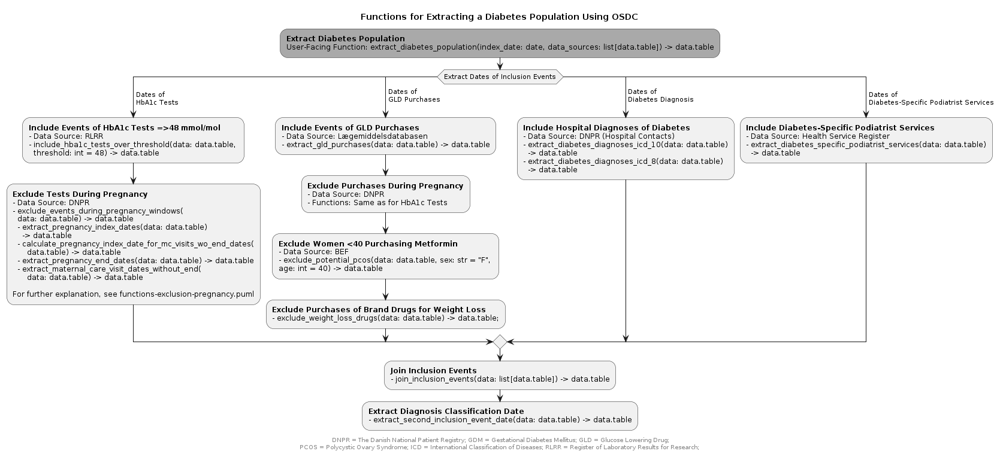

```{r, include = FALSE}
knitr::opts_chunk$set(
  collapse = TRUE,
  comment = "#>"
)
library(dplyr)
```

## Overview

The OSDC algorithm - and thereby, the osdc package - contains two main components:

- Extracting the diabetes population
- Classifying the diabetes type (type 1 and type 2)

## Extracting the diabetes population 

This component extracts the diabetes population based on the following four data sources:

- The Register of Laboratory Results for Research (RLRR) (Laboratoriedatabasens Forskertabel)
- The Danish National Patient Registry (DNPR) (Landspatient Registeret, LPR)
- Lægemiddelsdatabasen
- CPR-registerets befolkningstabel (BEF)
- The Health Service Register (Sygesikringsregisteret)

<!-- TODO: Add English translations for lægemiddelsdatabasen and BEF -->

This component will have one user-facing function: `extract_diabetes_population` which takes an `index_date` and the data sources as arguments.

As described in  `vignette("design")`, inclusion date is the date of the second inclusion criteria. Inclusion events include HbA1c measurements of ≥48 mmol/mol, hospital diagnoses of diabetes, diabetes-specific services received at podiatrist, and purchase of glucose-lowering drugs (GLD), while HbA1c samples and GLD purchases during pregnancies* are excluded, as are glucose-lowering brand drugs for weight loss and metformin purchases for women below age 40.

This results in the following functionality flow:



Note: All functions take a `data.frame` as input and outputs a `data.frame`.

